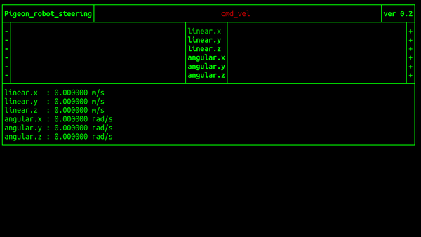

# Pigeon ROS TUI

### Yotube Video
   https://youtu.be/q2XomPOPMIA

### Development Environment

   OS : Ubuntu 18.04

   ROS Version : melodic
   
## Install

   - Clone the Pigeon ROS TUI & Install
   ```bash
   mkdir -p ~/catkin_ws/src
   cd ~/catkin_ws/src/
   git clone https://github.com/PigeonSensei/Pigeon_ros_tui.git
   catkin_init_workspace
   cd ..
   catkin_make 
   ```

## Usage Instructions
   Start with 'roscore' running
   ```bash
   roscore
   ```

   Requires source 'devel/setup.bash' input from /catkin_ws path
   ```bash
   source devel/setup.bash
   ```
### Start the pigeon_robot_steering_node

```bash
rosrun pigeon_tui pigeon_robot_steering_node
```

#### Input Key
- select Item : W,S
- Change value : A, S
- at Reset value : X
- all Reset value : Z
- exit : ESC
#### Published Topics
- /cmd_vel


The next node is under development ...

   
