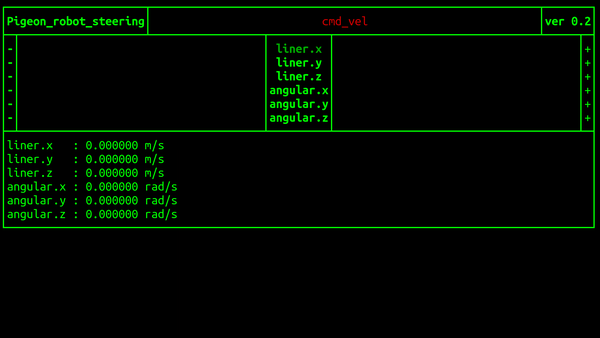

# Pigeon ROS TUI

### Yotube Video
   https://youtu.be/Xg472tPMs6U

### Development Environment

   OS : Ubuntu 18.04

   ROS Version : melodic
   
## Install

   - Create a [catkin](http://wiki.ros.org/catkin#Installing_catkin) workspace
   ```bash
   mkdir -p ~/catkin_ws/src
   cd ~/catkin_ws/src/
   ```

   - Clone the Pigeon ROS TUI & Install
   ```bash
   mkdir -p ~/catkin_ws/src
   cd ~/catkin_ws/src/
   git clone https://github.com/PigeonSensei/Pigeon_ros_tui.git
   catkin_init_workspace
   cd ..
   catkin_make 
   ```

## Usage Instructions
   Start with roscore running

   Requires source devel/setup.bash input from catkin_ws path
   ```bash
   ~/catkin_ws$ source devel/setup.bash
   ```
### Start the pigeon_robot_steering_node

```bash
rosrun pigeon_tui pigeon_robot_steering_node
```


#### Published Topics
- /cmd_vel


   
